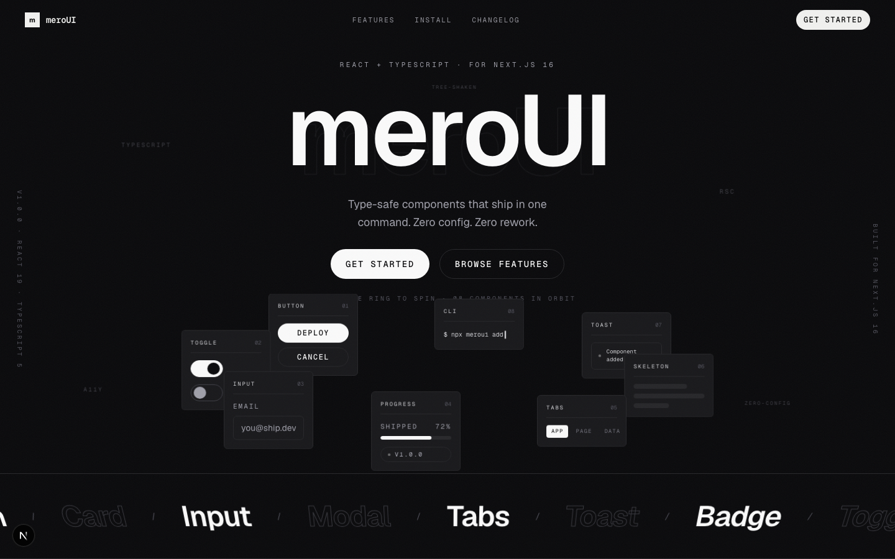

# meroUI

A modern, fully open-sourced UI library for **Next.js 16** and **React 19**.

Black by default. Type-safe, accessible, and zero-config. Use the components
freely for free. You only pay if you want a private, premium, complete web
design and development build.

---

## Preview

A live hero built from meroUI's own components:



---

## Sections

- **Hero** - interactive 3D component ring (drag to spin)
- **Marquee** - component index strip
- **Principles** - asymmetric showcase of the design rules
- **Install** - real package-manager install with live typing
- **Design** - premium web-design showcase, driven by markdown content
- **Footer** - links, careers, premium request, and ghosted wordmark

## Getting Started

First, run the development server:

```bash
npm run dev
# or
yarn dev
# or
pnpm dev
# or
bun dev
```

Open [http://localhost:3000](http://localhost:3000) with your browser to see the
result.

---

## License

Open-source components are free to use. Premium private web design &
development builds are paid work.
